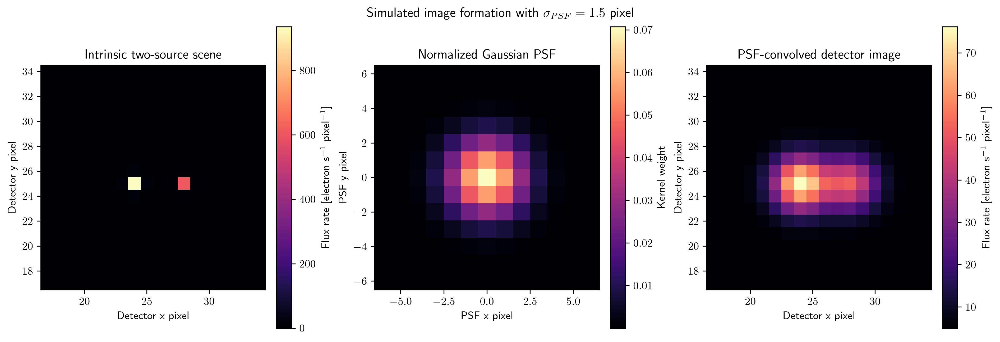

# Assos

Assos is a forward-modeling package for imaging data in the active astrophysics ecosystem. It is designed to synthesize observational imaging products, apply model-driven diagnostics, and provide a reproducible path from input image assumptions to transformed, diagnostic, and summary outputs.

## Scientific purpose

The package supports imaging-domain forward modeling for astrophysical scenes and catalog-level overlays. The core workflow is to construct a synthetic image or parameterized field, model the relevant structure, and visualize the result alongside diagnostic annotations or residual diagnostics.

## Current ecosystem role

Assos sits in the imaging and forward-modeling layer of the active stack. It builds on the shared numerical utilities in `tdpy`, overlaps conceptually with the lensing and image-simulation work in `chalcedon`, and contributes to the broader time-domain and imaging workflow around the active scientific repositories.

## Installation

```bash
cd assos
python -m pip install -e .
export ASSOS_PATH=/path/to/assos
```

`ASSOS_PATH` identifies the repository root. Keep runtime inputs in `data/` and generated pipeline outputs in `visuals/`; both directories are ignored by Git.

## Minimal workflow

The runnable forward-modeling example constructs an explicitly simulated two-source scene and passes it through Assos's normalized Gaussian point-spread function convolution:

```bash
python examples/psf_forward_model.py --typefileplot png
```



The panels expose the intrinsic source scene, the normalized point-spread function kernel, and the final detector image after convolution and addition of a uniform background. The two sources, their flux rates, the 1.5-pixel point-spread width, and the background rate are explicit simulation assumptions. The figure contains no observed data.

## Main modules

- `assos/imaging.py`: tested image-formation primitives.
- `assos/main.py`: legacy imaging workflows and plotting diagnostics.
- `tests/`: lightweight import and compatibility checks.

## Dependencies

The package depends on the standard scientific stack and imaging utilities, including:

- `numpy`
- `scipy`
- `matplotlib`
- `astropy`
- `h5py`
- `tdpy`
- `chalcedon`
- `nicomedia`
- `aspendos`

## Output behavior

Assos is intended to make imaging transformations and model assumptions visible through saved diagnostic figures. The main scientific emphasis is on keeping the model-data relationship inspectable rather than hiding it inside opaque processing steps.

## Development status

This repository is maintained as a focused imaging and forward-modeling workflow rather than a general-purpose analysis dump. It remains useful when used with the appropriate data products and parameter conventions, and its reusable functions should remain library-first rather than being spread across ad hoc scripts.

