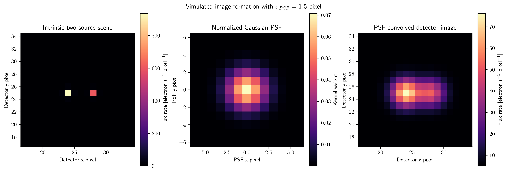

# Assos

Assos is a forward-modeling package for astrophysical imaging data. It synthesizes detector images from explicit source, background, and point-spread-function assumptions and produces diagnostics that expose each stage of the image-formation calculation.

## Purpose

The package supports imaging-domain forward modeling for astrophysical scenes and catalog-level overlays. The core workflow is to construct a synthetic image or parameterized field, model the relevant structure, and visualize the result alongside diagnostic annotations or residual diagnostics.

## Image forward modeling

Assos constructs parameterized source scenes, convolves them with normalized point-spread functions, adds detector backgrounds, and compares intrinsic scenes with their predicted detector images.

## Installation

```bash
cd assos
python -m pip install -e .
export ASSOS_PATH=/path/to/assos
```

`ASSOS_PATH` identifies the repository root. Keep runtime inputs in `data/` and generated pipeline outputs in `visuals/`; both directories are ignored by Git.

## Minimal workflow

The runnable forward-modeling example constructs an explicitly simulated two-source scene and passes it through Assos's normalized Gaussian point-spread function convolution:

```bash
python examples/psf_forward_model.py --typefileplot png
```



The panels expose the intrinsic source scene, the normalized point-spread function kernel, and the final detector image after convolution and addition of a uniform background. The two sources, their flux rates, the 1.5-pixel point-spread width, and the background rate are explicit simulation assumptions. The figure contains no observed data.

## Dependencies

The package depends on the standard scientific stack and imaging utilities, including:

- `numpy`
- `scipy`
- `matplotlib`
- `astropy`
- `h5py`
- `tdpy`
- `chalcedon`
- `nicomedia`
- `aspendos`

## Output behavior

Assos saves the intrinsic source scene, point-spread function, predicted detector image, and residual diagnostics needed to inspect the image-formation model.

